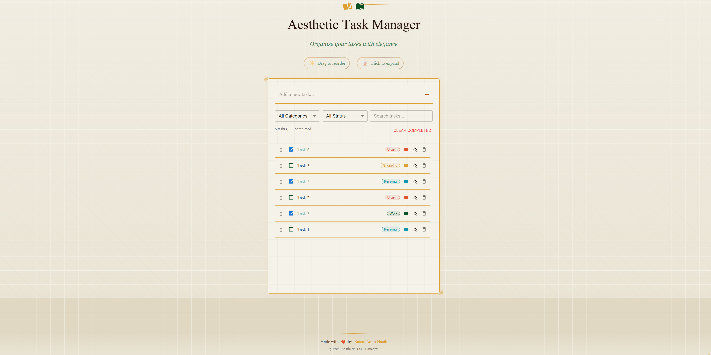

# Aesthetic Task Manager

A beautifully crafted task management application built with modern web technologies and a vintage-inspired design aesthetic.



## Live Preview

Check out the live demo: [Aesthetic Task Manager](https://aesthetic-task-manager.vercel.app/)

## Getting Started

1. **Clone the repository**
   ```bash
   git clone https://github.com/RaHasib/AestheticTaskManager.git
   ```

2. **Install dependencies**
   ```bash
   cd AestheticTaskManager
   npm install
   ```

3. **Run the development server**
   ```bash
   npm run dev
   ```

4. **Open [http://localhost:3000](http://localhost:3000)**


## Project Structure

```
src/
├── components/
│   ├── TodoList/
│   │   ├── AddTodo.js
│   │   ├── TodoFilters.js
│   │   ├── TodoItem.js
│   │   ├── TodoList.js
│   │   └── TodoStats.js
│   └── layout/
│       └── Footer.js
|       └── Header.js
|       └── Loader.js
├── constants/
│   └── categories.js
├── hooks/
│   └── useTodoList.js
├── pages/
│   ├── _app.js
│   └── index.js
└── styles/
    └── globals.css
```

### Filtering & Organization
- Filter by category
- Filter by status
- Search functionality
- Clear completed tasks

### User Experience
- Smooth animations
- Intuitive interactions
- Responsive design
- Keyboard accessibility

## Contributing

Contributions are welcome! Please feel free to submit a Pull Request.

1. Fork the project
2. Create your feature branch (`git checkout -b feature/AmazingFeature`)
3. Commit your changes (`git commit -m 'Add some AmazingFeature'`)
4. Push to the branch (`git push origin feature/AmazingFeature`)
5. Open a Pull Request
